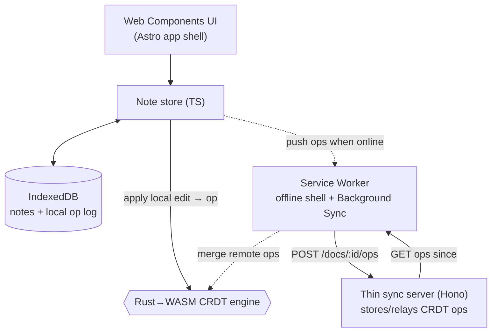

## The shape of the system

OfflineNotes is **client-owned data, merged by a WASM CRDT, relayed by a thin server**.

The **client is the source of truth**. Every edit is applied locally first: the note store hands it to the **WASM CRDT engine**, which turns it into an **op** and updates the in-memory document; the op and the new state persist to **IndexedDB**. The UI re-renders from local data. **None of this touches the network** — the app is fully usable offline, because offline is the default path, not a fallback.

Sync is a **background reconciliation**, not a dependency. When there's a connection, the client **pushes** its new ops to the thin server and **pulls** ops other devices pushed; the WASM engine **merges** them into the local document. Because the merge is conflict-free (that's what the CRDT guarantees), two devices that edited the same note while both offline converge to the *same* result once they sync — with no "which version do you want to keep?" prompt, ever.

## Why this shape

- **Local-first, not offline-as-error.** Reads and writes go to IndexedDB, so the app's responsiveness and availability never depend on the network. A server-first app with an "offline mode" inverts this and fights it forever.
- **CRDT for merge, not last-write-wins.** LWW silently throws away one device's edits. A CRDT is a data structure whose merge is *commutative, associative, and idempotent* — apply the same ops in any order, any number of times, and every replica converges. That's the only way concurrent offline edits merge without a central referee.
- **WASM for the engine.** The merge logic must be identical and correct in every client; writing it once in Rust and compiling to WASM gives one portable, fast, well-tested core instead of a subtly-different reimplementation per client.
- **The server is thin on purpose.** It stores and relays opaque CRDT ops; it never merges, never owns the truth, and could be swapped for peer-to-peer transport without touching the client's data model.

The cost is real: CRDTs carry metadata (they grow with edit history unless compacted), the WASM boundary needs careful data marshalling, and "eventually consistent" means a device can briefly show stale data before a sync. Several modules exist to handle exactly these.

## The pieces

- **Web Components UI + Astro shell** — `<note-list>`, `<note-editor>`, `<sync-status>`; Astro builds and hosts the installable app.
- **IndexedDB** — the local source of truth: notes and their op log.
- **Rust→WASM CRDT engine** — `apply_local(edit) → op`, `merge(remote_ops)`, `text()`; an LWW register for fields + a sequence CRDT for the body.
- **Service Worker** — precaches the shell for offline use and drives Background Sync.
- **Thin sync server (Hono)** — `POST /docs/:id/ops`, `GET /docs/:id/ops?since=`; stores and relays ops, nothing more.

## Verify

You're ready to move on when you can answer these in your own words:

- Trace an edit from a keypress to IndexedDB with the network off. Where does the WASM CRDT sit in that path, and why does it run *before* any sync?
- Two devices edit the same note offline, then both come online. Why do they converge to the same note, and what property of the CRDT guarantees it?
- Why is the sync server described as "thin"? What does it deliberately *not* do that a server-first backend would?
- Name two real costs this architecture pays that a simple server-first notes app avoids.

Next, the [prerequisites](/offlinenotes/en/introduction/prerequisites/) get your machine ready.
