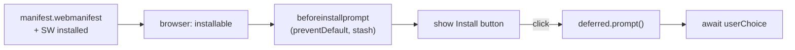

The Service Worker makes OfflineNotes load offline. This lesson makes it **installable**: a manifest tells the browser it's an app, a captured `beforeinstallprompt` lets us offer install on our own terms, and the DevTools Application panel confirms it all works with the network off.

## What we're building

Three pieces that turn a cached site into an installed app:

- **The web app manifest** — name, icons, `start_url`, `display: standalone`, and the teal theme colour, linked from the page head.
- **A custom install flow** — intercept `beforeinstallprompt`, stash the event, show our own "Install" button, and trigger the native prompt on click.
- **Verification** — the Application panel's Manifest and Service Workers views, plus the Offline throttle, to prove installability and offline launch.



## Why

Installability is a **contract the browser enforces**: it only offers to install a site that has a valid manifest (with the required fields and icons) *and* a Service Worker controlling the page. We satisfied the second half last lesson; the manifest is the first. Meeting the contract is also a useful audit — if the app is installable, it's genuinely offline-capable, because the browser checked.

We intercept `beforeinstallprompt` rather than letting the browser show its default mini-infobar because **timing and placement are product decisions**. Firing an install prompt the instant a first-time visitor lands is the fastest way to get it dismissed forever. Calling `preventDefault()` and stashing the event lets us surface install where it makes sense — next to a "works offline" hint, after the user has actually written a note — and the stashed event still triggers the *real* native prompt when they click.

The honest limits: `beforeinstallprompt` is a Chromium feature and won't fire in every browser (iOS Safari installs via the Share sheet instead), and it only fires when the criteria are met and the app isn't already installed. So the custom button is a progressive enhancement — present when the platform offers it, absent when it doesn't, never a hard dependency.

## Pros & cons

**Capturing `beforeinstallprompt` for a custom button, vs. the browser's default prompt.**

- **Pros:** You choose when and where to ask, tie it to a moment the user values, and can hide it once installed — far higher accept rates than an unsolicited banner.
- **Cons:** Chromium-only; you must handle browsers where the event never fires, and you own the button's lifecycle (show, hide on install, hide on dismiss).

**A standalone installed PWA, vs. staying a browser tab.**

- **Pros:** Own window and icon, no address bar, launches from the home screen or dock — it feels like the native notes app the project is imitating.
- **Cons:** Users must opt in to install, updates flow through the Service Worker's cache-versioning (not an app store), and standalone mode hides browser affordances some users rely on.

## Set it up

### 1. `apps/web/public/manifest.webmanifest`

Served at `/offlinenotes/manifest.webmanifest`. `start_url` and `scope` include the base path so the installed app opens to the right place. The theme colour is the project teal.

```json
{
  "name": "OfflineNotes",
  "short_name": "OfflineNotes",
  "description": "Local-first markdown notes that work fully offline.",
  "start_url": "/offlinenotes/",
  "scope": "/offlinenotes/",
  "display": "standalone",
  "background_color": "#ffffff",
  "theme_color": "#0D9488",
  "icons": [
    { "src": "/offlinenotes/icons/icon-192.png", "sizes": "192x192", "type": "image/png" },
    { "src": "/offlinenotes/icons/icon-512.png", "sizes": "512x512", "type": "image/png" },
    {
      "src": "/offlinenotes/icons/icon-maskable-512.png",
      "sizes": "512x512",
      "type": "image/png",
      "purpose": "maskable"
    }
  ]
}
```

### 2. `apps/web/src/layouts/AppLayout.astro`

Link the manifest and set the theme colour in the page head so the browser can read them.

```astro
<head>
  <meta name="viewport" content="width=device-width, initial-scale=1" />
  <link rel="manifest" href="/offlinenotes/manifest.webmanifest" />
  <meta name="theme-color" content="#0D9488" />
  <link rel="icon" href="/offlinenotes/favicon.svg" />
</head>
```

### 3. `apps/web/src/install-prompt.ts`

Capture the event, reveal the button, and drive the native prompt on click. The `BeforeInstallPromptEvent` type isn't in the DOM lib, so declare the shape we use.

```ts
interface BeforeInstallPromptEvent extends Event {
  prompt(): Promise<void>;
  userChoice: Promise<{ outcome: 'accepted' | 'dismissed' }>;
}

let deferred: BeforeInstallPromptEvent | null = null;

export function wireInstallPrompt(button: HTMLButtonElement) {
  button.hidden = true;

  window.addEventListener('beforeinstallprompt', (event) => {
    // Stop the browser's default mini-infobar; keep the event for later.
    event.preventDefault();
    deferred = event as BeforeInstallPromptEvent;
    button.hidden = false;
  });

  button.addEventListener('click', async () => {
    if (!deferred) return;
    await deferred.prompt();
    const { outcome } = await deferred.userChoice;
    console.log(`install ${outcome}`);
    // A prompt can only be used once; drop it and hide the button.
    deferred = null;
    button.hidden = true;
  });

  // Already installed (or just accepted): make sure the button is gone.
  window.addEventListener('appinstalled', () => {
    deferred = null;
    button.hidden = true;
  });
}
```

### 4. `apps/web/src/main.ts`

Wire the button alongside the Service Worker registration.

```ts
import { registerServiceWorker } from './register-sw';
import { wireInstallPrompt } from './install-prompt';

registerServiceWorker();

const installBtn = document.querySelector<HTMLButtonElement>('#install');
if (installBtn) wireInstallPrompt(installBtn);
```

## Verify

Installability needs the real manifest and Service Worker, so test the build, not the dev server:

```bash
pnpm --filter web build
pnpm --filter web preview
```

Open the preview URL, then in DevTools → Application:

- **Manifest** — fields render, icons resolve, and there's no "installability" error; a note like *"Page is installable"* (or an install icon in the address bar) confirms the contract is met.
- **Service Workers** — the worker is *activated*.
- Click the address-bar install icon (or your custom **Install** button); the app opens in its own standalone window.

Now confirm it launches with no network. In DevTools → Network set the throttle to **Offline**, then relaunch the installed app (or reload):

```text
Network throttle: Offline
Relaunch installed app → OfflineNotes opens, notes load from IndexedDB
```

Finally, a clean build as the gate:

```bash
pnpm --filter web build
# ✓ built in <time>
```

**Check your understanding:**

1. What two conditions must hold before a browser considers the app installable?
2. Why call `preventDefault()` on `beforeinstallprompt` and store the event instead of letting the default banner show?
3. Why can't you re-use a stashed prompt event for a second install attempt?
4. Which DevTools panel and setting let you prove the *installed* app launches with the network off?

## Recap

OfflineNotes is now a real PWA: a manifest declares it an app, a captured `beforeinstallprompt` offers install on our terms, and the Application panel confirms it installs and launches fully offline. The whole client — data, code, and shell — runs with no network. What it can't yet do is *share* edits between devices. Next, [The Sync Server →](/offlinenotes/en/sync-server/) builds the thin Hono backend that stores and relays the CRDT ops sitting in the outbox.
