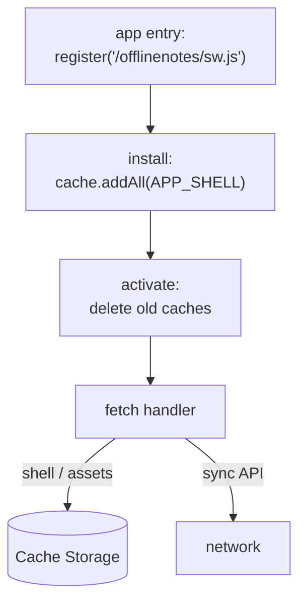

The data already lives in IndexedDB, so notes survive offline — but reload the page with no network and you get the browser's dinosaur, because the HTML, JS, and WASM come from the server. A **Service Worker** fixes that by caching the app shell itself. We hand-roll it (no Workbox) so every line is visible.

## What we're building

`apps/web/public/sw.js`, a Service Worker with the three lifecycle handlers:

- **`install`** — open a versioned cache and precache the app shell (the route HTML, manifest, icons, and built entry).
- **`activate`** — delete caches from previous versions so old assets don't linger forever.
- **`fetch`** — serve the shell and static assets **cache-first**; let the sync API always go to the **network**.

Plus a one-line registration from the app entry so the browser installs it.



## Why

A Service Worker is a **network proxy that persists across page loads**. Once installed, it sits between the app and the network and answers `fetch` events even when the tab was just opened cold with the radio off. That's the missing half of offline-first: IndexedDB makes the *data* local; the Service Worker makes the *code that renders it* local too. Without both, "offline" only works if the user never closed the tab.

Cache-first is the right default *for the shell* precisely because the shell is our own versioned build — a hashed asset never changes under a given URL, so returning the cached copy is not just faster, it's correct. The sync API is the opposite: its whole value is fresh ops from other devices, so it must reach the network and should never be answered from a stale cache. Splitting the two by request kind, rather than caching everything, is what keeps the app both instant and correct.

We skip Workbox on purpose. In production you'd likely use it, and Astro can generate a precache manifest of hashed files at build time. Here the goal is to *understand* the lifecycle — install, activate, fetch, and cache versioning — not to abstract it away.

## Pros & cons

**Cache-first for the shell, vs. network-first with a cache fallback.**

- **Pros:** Instant loads and genuine offline — the cached shell renders before the network is even consulted; a flaky connection never delays startup.
- **Cons:** A newly deployed shell isn't seen until the SW updates and its cache version bumps; you must manage versioning deliberately or users run stale code.

**A hand-rolled SW, vs. Workbox / a generated precache manifest.**

- **Pros:** Every behaviour is explicit and debuggable; nothing hidden, ideal for learning the platform primitives.
- **Cons:** You maintain the shell list and cache-busting yourself; hashed asset filenames change each build, so a static list needs runtime caching (below) to stay complete.

## Set it up

### 1. `apps/web/public/sw.js`

Files in `public/` are served at the site root, so with `base: '/offlinenotes'` this lands at `/offlinenotes/sw.js`. Bump `CACHE` whenever the shell changes — the new version's `install` recaches, and `activate` evicts the old one.

```js
// apps/web/public/sw.js
const CACHE = 'offlinenotes-v1';
const BASE = '/offlinenotes/';

// The minimal shell needed to boot the app offline. Hashed build assets
// (/_astro/*) are cached at runtime by the fetch handler below.
const APP_SHELL = [
  BASE,
  `${BASE}index.html`,
  `${BASE}manifest.webmanifest`,
  `${BASE}favicon.svg`,
  `${BASE}icons/icon-192.png`,
  `${BASE}icons/icon-512.png`,
];

self.addEventListener('install', (event) => {
  event.waitUntil(
    caches.open(CACHE).then((cache) => cache.addAll(APP_SHELL)),
  );
  // Activate this SW as soon as it finishes installing.
  self.skipWaiting();
});

self.addEventListener('activate', (event) => {
  event.waitUntil(
    caches.keys().then((keys) =>
      Promise.all(keys.filter((k) => k !== CACHE).map((k) => caches.delete(k))),
    ),
  );
  // Take control of open pages without requiring a reload.
  self.clients.claim();
});

self.addEventListener('fetch', (event) => {
  const { request } = event;

  // Only handle same-origin GETs. The sync API (cross-origin, and often
  // POST) falls through to the network untouched.
  if (request.method !== 'GET') return;
  const url = new URL(request.url);
  if (url.origin !== self.location.origin) return;

  // Cache-first: serve from cache, else fetch and cache the response
  // (this fills in hashed /_astro/* assets on first visit).
  event.respondWith(
    caches.match(request).then((cached) => {
      if (cached) return cached;
      return fetch(request).then((response) => {
        if (response.ok && response.type === 'basic') {
          const copy = response.clone();
          caches.open(CACHE).then((cache) => cache.put(request, copy));
        }
        return response;
      });
    }),
  );
});
```

### 2. `apps/web/src/register-sw.ts`

Register from the app entry, guarding for support and scoping the worker to the app base. Registering after `load` avoids competing with the page's first paint for bandwidth.

```ts
export function registerServiceWorker() {
  if (!('serviceWorker' in navigator)) return;
  window.addEventListener('load', () => {
    navigator.serviceWorker
      .register(`${import.meta.env.BASE_URL}sw.js`, {
        scope: import.meta.env.BASE_URL, // '/offlinenotes/'
      })
      .then((reg) => console.log('SW registered:', reg.scope))
      .catch((err) => console.error('SW registration failed:', err));
  });
}
```

### 3. `apps/web/src/main.ts`

Call it once from the entry that boots the app.

```ts
import { registerServiceWorker } from './register-sw';

registerServiceWorker();
```

## Verify

A Service Worker only controls pages served over `https` or `localhost`, and its caching is easiest to see against a real build. Build and preview:

```bash
pnpm --filter web build
pnpm --filter web preview   # serves the built site on localhost
```

Open the preview URL, then in DevTools → Application:

- **Service Workers** — the worker shows *activated and running*, scope `/offlinenotes/`.
- **Cache Storage** — a `offlinenotes-v1` cache lists the shell URLs; reload once and `/_astro/*` assets appear too.

Now prove true offline. In DevTools → Network, switch the throttle to **Offline**, then reload:

```text
Network throttle: Offline
Reload → the app still renders (served from Cache Storage)
```

Bump `CACHE` to `offlinenotes-v2`, rebuild, reload twice, and confirm the old cache is gone from Cache Storage — that's `activate` cleaning up.

**Check your understanding:**

1. Why does IndexedDB alone not make the app work offline after the tab is closed and reopened?
2. What does `install` do, and why wrap `cache.addAll(...)` in `event.waitUntil`?
3. Why is cache-first correct for hashed build assets but wrong for the sync API?
4. What breaks if you never bump `CACHE`, and what does the `activate` handler do about old versions?

## Recap

A hand-rolled Service Worker now precaches the shell on `install`, evicts stale caches on `activate`, and serves the app cache-first while the sync API still reaches the network — so OfflineNotes loads with the network fully off. It runs, but the browser won't yet offer to *install* it to the home screen. Next, [Installable PWA →](/offlinenotes/en/service-worker/installable-pwa/) adds the manifest and install prompt and verifies full offline use in DevTools.
