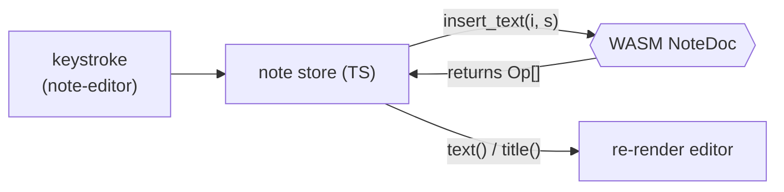

You built the CRDT in [A CRDT in Rust →](/offlinenotes/en/crdt-rust/) and a typed store in [IndexedDB Foundation →](/offlinenotes/en/indexeddb/). This lesson connects them: the note store boots the WASM module, holds a live `NoteDoc`, and turns each keystroke into an **op**.

## What we're building

A note store (`store.ts`) that owns the WASM CRDT for the open note. It exposes three edit methods — `setTitle`, `insertText`, `deleteText` — that call into `NoteDoc`, collect the ops the engine returns, and re-render the UI from `title()` and `text()`.

The key inversion: the UI never mutates a string directly. It asks the CRDT to apply an edit, and the CRDT is the one authority on what the document now says. Ops are the by-product we will persist and sync in the next lessons; here we just make them flow.



## Why

The CRDT engine is the single source of correctness. Every device runs the *same* Rust code compiled to WASM, so an edit applied on one client produces an op that means exactly the same thing on another. If the UI edited a plain JavaScript string and only *later* handed it to the CRDT, the two representations could drift — and drift is precisely what a CRDT exists to prevent.

Applying edits through `NoteDoc` first also gives us the op for free. `insert_text` doesn't just mutate the document; it *returns* the ops that describe the mutation. That return value is the atom we store in the outbox and push to the server. Producing state and producing the sync record in one call means they can never disagree.

## Pros & cons

**Ops as the return value of every edit, vs. diffing state after the fact.**

- **Pros:** The op is exact and intent-preserving — insert "x" at position 3 is one `ins` op, not a guess reconstructed by comparing two strings. No diff algorithm to get subtly wrong.
- **Cons:** Every edit path must go through the CRDT method; you can't take a shortcut and set `textarea.value` directly, or the op log and the visible text fall out of step.

**Booting WASM once and holding a live `NoteDoc`, vs. rebuilding from a snapshot on each edit.**

- **Pros:** Edits are cheap in-memory method calls; the engine keeps its internal indices warm.
- **Cons:** The live document is mutable state you must own carefully — one `NoteDoc` per open note, and you must not lose it without persisting (the next lesson closes that gap).

## Set it up

### 1. `apps/web/src/store.ts`

Boot the WASM module exactly once, then keep the open note's `NoteDoc` in memory. The `init` default export loads and instantiates the `.wasm` file; you must `await` it before constructing any exported type.

```ts
import init, { NoteDoc } from '../../../crates/crdt/pkg/crdt.js';
import { getMeta, setMeta } from './db';

// The op wire format, shared with the outbox and the sync server.
export type ActorId = string;
export type OpId = [counter: number, actor: ActorId];
export type Op =
  | { t: 'title'; value: string; ts: OpId }
  | { t: 'ins'; id: OpId; after: OpId | null; ch: string }
  | { t: 'del'; id: OpId };

let wasmReady: Promise<void> | null = null;

/** Load and instantiate the WASM module exactly once, however often it's called. */
function ensureWasm(): Promise<void> {
  wasmReady ??= init().then(() => undefined);
  return wasmReady;
}

/** A stable per-device id; the CRDT uses it to tie-break and to stamp op ids. */
async function getActorId(): Promise<ActorId> {
  let actorId = await getMeta<ActorId>('actorId');
  if (!actorId) {
    actorId = crypto.randomUUID();
    await setMeta('actorId', actorId);
  }
  return actorId;
}
```

### 2. `apps/web/src/store.ts` — the open-note store

Wrap the live `NoteDoc` in a small object. Each edit method returns the ops so callers (the next lesson) can persist them; `onChange` fires after every edit so the editor re-renders from CRDT state.

```ts
// serde-wasm-bindgen may hand back a single op or an array; normalise to Op[].
function toOps(value: unknown): Op[] {
  return Array.isArray(value) ? (value as Op[]) : [value as Op];
}

export interface OpenNote {
  readonly id: string;
  setTitle(title: string): Op[];
  insertText(index: number, s: string): Op[];
  deleteText(index: number, len: number): Op[];
  title(): string;
  text(): string;
}

export async function openBlankNote(
  id: string,
  onChange: () => void,
): Promise<OpenNote> {
  await ensureWasm();
  const actorId = await getActorId();
  const doc = new NoteDoc(actorId);

  return {
    id,
    setTitle(title) {
      const ops = toOps(doc.set_title(title));
      onChange();
      return ops;
    },
    insertText(index, s) {
      const ops = toOps(doc.insert_text(index, s));
      onChange();
      return ops;
    },
    deleteText(index, len) {
      const ops = toOps(doc.delete_text(index, len));
      onChange();
      return ops;
    },
    title: () => doc.title(),
    text: () => doc.text(),
  };
}
```

### 3. `apps/web/src/components/note-editor.ts`

The editor never edits its own string. It computes the changed range, calls the store, and paints back what the CRDT reports. This snippet shows title and a whole-value replacement for the body — reducing a full replacement to insert/delete keeps the wiring honest while we learn.

```ts
import type { OpenNote } from '../store';

export class NoteEditor extends HTMLElement {
  private note!: OpenNote;
  private titleEl!: HTMLInputElement;
  private bodyEl!: HTMLTextAreaElement;

  bind(note: OpenNote) {
    this.note = note;
    this.titleEl.value = note.title();
    this.bodyEl.value = note.text();

    this.titleEl.addEventListener('input', () => {
      this.note.setTitle(this.titleEl.value);
    });

    this.bodyEl.addEventListener('input', () => {
      // Replace the whole body: delete the old text, insert the new.
      const previous = this.note.text();
      if (previous.length) this.note.deleteText(0, previous.length);
      if (this.bodyEl.value.length) this.note.insertText(0, this.bodyEl.value);
    });
  }

  /** Called by the store's onChange: repaint from CRDT truth. */
  render() {
    if (this.titleEl.value !== this.note.title()) this.titleEl.value = this.note.title();
    if (this.bodyEl.value !== this.note.text()) this.bodyEl.value = this.note.text();
  }
}

customElements.define('note-editor', NoteEditor);
```

## Verify

Wire the store to a page and drive it from the browser console. First confirm the WASM package is built:

```bash
pnpm --filter web build:wasm   # runs: wasm-pack build --target web (crates/crdt → pkg)
ls crates/crdt/pkg/crdt.js
# crates/crdt/pkg/crdt.js
```

Then, with the dev server up, exercise the store in the DevTools console:

```js
const note = await window.__store.openBlankNote('n1', () => {});
note.setTitle('Groceries');
const ops = note.insertText(0, 'milk');
console.log(note.title(), '/', note.text());
// Groceries / milk
console.log(JSON.stringify(ops));
// [{"t":"ins","id":[1,"<actor>"],"after":null,"ch":"m"}, ... ]
```

Finally, run the app build to prove the WASM import resolves through Vite:

```bash
pnpm --filter web build
# ✓ built in <time>
```

**Check your understanding:**

1. Why does the editor call `insertText` instead of setting `textarea.value` and reading it back later?
2. What does `insert_text` return besides mutating the document, and why is that return value the thing we care about most?
3. Why must `await init()` complete before `new NoteDoc(actorId)` — what would happen otherwise?
4. Why keep one live `NoteDoc` in memory rather than rebuilding it from stored state on every keystroke?

## Recap

The note store now boots the WASM CRDT, holds a live `NoteDoc` per open note, and turns every edit into ops while the UI renders from `title()` and `text()`. The ops flow but evaporate — nothing is saved yet. Next, [Persisting ops →](/offlinenotes/en/wiring-wasm/persisting-ops/) writes the snapshot to IndexedDB and queues each op in the outbox, so a reload restores the exact document.
