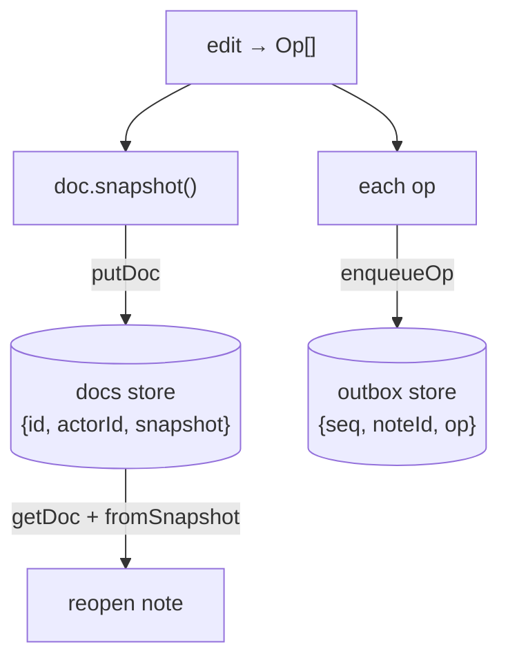

Ops now flow from every edit, but they vanish on reload. This lesson makes the document durable: the full CRDT **snapshot** goes to the `docs` store, each **op** is queued in the `outbox`, and reopening a note rebuilds it with `NoteDoc.fromSnapshot`.

## What we're building

Two write paths and one read path, all through the typed `db.ts` wrapper from the IndexedDB module:

- **On every edit** — persist the new snapshot to `docs` (the authoritative state) and append the returned ops to `outbox` (the not-yet-synced queue), and refresh the `notes` list projection.
- **On open** — read the note's record from `docs` and reconstruct the live document with `NoteDoc.fromSnapshot(actorId, snapshot)`.

The editor keeps rendering from `title()` and `text()` exactly as before; it never knows persistence happened.



## Why

We store **two representations on purpose**, because they answer two different questions. The snapshot answers "what does this note say *right now*?" — it's what we load to show the note instantly, without replaying history. The outbox answers "what have I changed that the server hasn't seen yet?" — it's the exact op stream we will push in the sync module.

Could we keep only the op log and replay it? Yes, and a pure event-sourced design would. But replaying every op since creation to open a note gets slower with every edit, and the whole point of local-first is that opening a note is instant and offline. The snapshot is a cache of the folded-up state; the outbox is the tail we still owe the network. Keeping both is the pragmatic middle: fast reads *and* a precise sync record.

`fromSnapshot` is what makes the snapshot trustworthy. Because it reconstructs a `NoteDoc` with the *same* actor id and internal counters, edits made after a reload produce ops that slot correctly into the same causal history — a restored note is indistinguishable from one that was never closed.

## Pros & cons

**Persisting a snapshot on every edit, vs. persisting only the op log.**

- **Pros:** Opening a note is one `getDoc` and one `fromSnapshot` — constant time, no replay. Survives reload and browser restart.
- **Cons:** The snapshot carries CRDT metadata (tombstones from deleted text never shrink without compaction — the honest caveat from the CRDT module), so the stored blob grows with edit history.

**A separate outbox queue, vs. deriving un-synced ops from the snapshot at push time.**

- **Pros:** The outbox is an explicit, ordered, append-only record of exactly what to send; draining it is trivial and idempotent-friendly.
- **Cons:** It's a second store to keep consistent with `docs` — both writes should happen together, or a crash between them could drop an op from the queue while keeping it in state.

## Set it up

### 1. `apps/web/src/db.ts` — the accessors we rely on

These come from the [IndexedDB Foundation →](/offlinenotes/en/indexeddb/) module; the shapes must match the contract exactly. The `outbox` key `seq` autoincrements, so `enqueueOp` supplies no key.

```ts
import { openDB, type DBSchema } from 'idb';
import type { Op } from './store';

interface NotesDB extends DBSchema {
  notes: { key: string; value: { id: string; title: string; updatedAt: number } };
  docs: { key: string; value: { id: string; actorId: string; snapshot: unknown } };
  outbox: {
    key: number;
    value: { seq: number; noteId: string; op: Op };
    autoIncrement: true;
  };
  meta: { key: string; value: { key: string; value: unknown } };
}

const dbp = openDB<NotesDB>('offlinenotes', 1, {
  upgrade(db) {
    db.createObjectStore('notes', { keyPath: 'id' });
    db.createObjectStore('docs', { keyPath: 'id' });
    db.createObjectStore('outbox', { keyPath: 'seq', autoIncrement: true });
    db.createObjectStore('meta', { keyPath: 'key' });
  },
});

export async function putDoc(rec: { id: string; actorId: string; snapshot: unknown }) {
  return (await dbp).put('docs', rec);
}
export async function getDoc(id: string) {
  return (await dbp).get('docs', id);
}
export async function putNote(rec: { id: string; title: string; updatedAt: number }) {
  return (await dbp).put('notes', rec);
}
export async function enqueueOp(noteId: string, op: Op) {
  // seq is autoIncremented by IndexedDB; omit it from the value.
  return (await dbp).add('outbox', { noteId, op } as never);
}
```

### 2. `apps/web/src/store.ts` — persist on change

Extend the store so the mutators save before they return. A single helper folds the three writes together: snapshot to `docs`, ops to `outbox`, projection to `notes`. Wrapping edit and persist in one method keeps `docs` and `outbox` in step.

```ts
import init, { NoteDoc } from '../../../crates/crdt/pkg/crdt.js';
import { getDoc, putDoc, putNote, enqueueOp } from './db';

async function persist(id: string, actorId: string, doc: NoteDoc, ops: Op[]) {
  // snapshot() serialises the whole CRDT via serde-wasm-bindgen.
  await putDoc({ id, actorId, snapshot: doc.snapshot() });
  for (const op of ops) await enqueueOp(id, op);
  await putNote({ id, title: doc.title(), updatedAt: Date.now() });
}
```

### 3. `apps/web/src/store.ts` — open from snapshot

`openNote` reads `docs`; if a record exists it rebuilds with `fromSnapshot`, otherwise it starts a fresh `NoteDoc`. The edit methods now `await persist(...)` before firing `onChange`.

```ts
export async function openNote(id: string, onChange: () => void): Promise<OpenNote> {
  await ensureWasm();
  const actorId = await getActorId();

  const stored = await getDoc(id);
  const doc = stored
    ? NoteDoc.fromSnapshot(stored.actorId, stored.snapshot)
    : new NoteDoc(actorId);
  const docActor = stored?.actorId ?? actorId;

  const applied = async (ops: Op[]) => {
    await persist(id, docActor, doc, ops);
    onChange();
    return ops;
  };

  return {
    id,
    setTitle: (t) => toOps(doc.set_title(t)),        // then: applied(...)
    insertText: (i, s) => applied(toOps(doc.insert_text(i, s))) as unknown as Op[],
    deleteText: (i, n) => applied(toOps(doc.delete_text(i, n))) as unknown as Op[],
    title: () => doc.title(),
    text: () => doc.text(),
  };
}
```

> The edit methods are async now (they await IndexedDB). Have the editor `await note.insertText(...)` so a keystroke isn't lost if two edits race; IndexedDB writes are queued, but your in-memory `doc` must stay the ordering authority.

## Verify

Build the WASM package and the app, then prove durability by hand. In the DevTools console:

```js
const note = await window.__store.openNote('n1', () => {});
await note.insertText(0, 'buy milk');
await note.setTitle('Groceries');
// Reload the page (Cmd-R), then:
const again = await window.__store.openNote('n1', () => {});
console.log(again.title(), '/', again.text());
// Groceries / buy milk
```

Inspect the stores in DevTools → Application → IndexedDB → `offlinenotes`:

```text
docs    → { id: "n1", actorId: "…", snapshot: {…} }
outbox  → { seq: 1, noteId: "n1", op: {…} }, { seq: 2, … }, …
notes   → { id: "n1", title: "Groceries", updatedAt: 173… }
```

Then run the production build to confirm everything type-checks and bundles:

```bash
pnpm --filter web build
# ✓ built in <time>
```

**Check your understanding:**

1. Why store both a snapshot in `docs` and the ops in `outbox`, instead of just one of them?
2. What does `NoteDoc.fromSnapshot(actorId, snapshot)` reconstruct that a fresh `new NoteDoc(actorId)` would not have?
3. Why should the snapshot write and the outbox appends happen together for a single edit?
4. What grows without bound in the stored snapshot, and which later technique (named in the CRDT module) would bound it?

## Recap

A note is now durable: every edit saves its snapshot to `docs`, queues its ops in `outbox`, and refreshes the `notes` projection; reopening rebuilds the exact document with `fromSnapshot`. The outbox is a precise record of what we still owe the network — but nothing reads it yet, and the app still needs a live server to work. Next, [Service Worker (Offline) →](/offlinenotes/en/service-worker/) makes the app shell itself load with no network, so OfflineNotes truly runs offline.
