You started with an empty repo and built a real local-first application: a notes app that is fully usable with the network off, and that merges concurrent edits across devices without ever asking "which version do you want to keep?". This page steps back from the code to consolidate what that took and why it's shaped the way it is.

## What you built

- A **Rust CRDT** — an LWW register for the title and an RGA sequence for the body — compiled to **WASM** and driven from TypeScript across a `serde-wasm-bindgen` boundary.
- A **local-first client**: Web Components on an Astro shell, with **IndexedDB** as the source of truth (`docs` snapshots, an `outbox` of un-pushed ops, a `notes` list projection).
- A **Service Worker** that precaches the shell for true offline use and, via **Background Sync**, defers sync while offline and retries when connectivity returns.
- A **thin Hono sync server** that relays per-note CRDT ops and nothing more — deployed to a Cloudflare Worker backed by a Durable Object, with the PWA on Cloudflare Pages.

Every one of those is a deliberate decision with a cheaper alternative you chose *not* to take. That's the point of this recap.

## The path of an edit

Here is the whole system in one trace — a single keypress on one device becoming identical text on another, with no conflict prompt anywhere along the way.

```mermaid
flowchart TD
    Key["Keypress in &lt;note-editor&gt;"]
    Op["NoteDoc.insert_text&#40;i, ch&#41; produces an Insert op"]
    IDB[("IndexedDB: docs snapshot + outbox op")]
    Online{"Online?"}
    Wait["Deferred by Background Sync"]
    Push["Drain outbox: POST /docs/:id/ops"]
    Server["Sync server appends with a server seq"]
    Pull["Other device: GET /docs/:id/ops?since="]
    Merge["NoteDoc.merge&#40;ops&#41; on the other device"]
    Same["Both devices show the same text"]

    Key --> Op --> IDB --> Online
    Online -->|"no"| Wait
    Wait -.->|"back online"| Push
    Online -->|"yes"| Push
    Push --> Server --> Pull --> Merge --> Same
```

Read it as the argument of the whole course: **the edit is durable and visible before the network is ever consulted**. Sync is a background reconciliation, and because the merge is a CRDT, the reconciliation is guaranteed to converge rather than conflict.

## The decisions you can now defend

You didn't just wire these together — you chose each over a simpler option and can say why. Each links back to the module where you built it.

| Decision | Why | Tradeoff | Where you built it |
|---|---|---|---|
| **Local-first, not server-first** | Reads/writes hit IndexedDB, so responsiveness and availability never depend on the network; offline is the default path, not an error case. | Client code is more complex, and data can be briefly stale before a sync. | [Introduction · Architecture →](/offlinenotes/en/introduction/architecture/) |
| **CRDT, not last-write-wins** | A merge that's commutative, associative, and idempotent lets concurrent offline edits converge with no central referee — LWW would silently discard one device's edits. | CRDTs carry metadata (tombstones, ids) that grows with edit history. | [A CRDT in Rust →](/offlinenotes/en/crdt-rust/) |
| **Rust → WASM merge engine** | One portable, fast, well-tested core runs identically in every client, instead of a subtly-different reimplementation per platform. | A WASM boundary to marshal data across, and a Rust toolchain in the build. | [Rust → WASM Toolchain →](/offlinenotes/en/wasm-toolchain/) |
| **Thin relay server** | The server only stores and relays opaque ops — it never merges or owns the truth, so it could be swapped for peer-to-peer transport without touching the data model. | You still run and deploy *a* server; "eventual" consistency is on you to handle in the UI. | [The Sync Server →](/offlinenotes/en/sync-server/) |
| **Background Sync** | Pushing is deferred while offline and retried by the browser when connectivity returns, so a sync never blocks an edit. | Patchy browser support, needing an `online`/focus fallback. | [Background Sync →](/offlinenotes/en/background-sync/) |

## What was deliberately simplified

An honest local-first app names its shortcuts. These were the right calls for *learning*, and each is a real thing you'd change for production.

- **A hand-rolled RGA instead of Automerge or Yjs.** Building the CRDT yourself is how you understand what those libraries do — but they are battle-tested, faster, and handle far more than title + body. In production you'd adopt one.
- **No auth, no access control.** A note id is a capability: anyone who knows it can read and append. Real multi-user sync needs identity and authorization on the relay.
- **An in-memory `Map` before deploy.** Modules 9–12 relayed ops from a process-local `Map` — fine on `localhost`, gone on the next restart. Deployment replaced it with a Durable Object; the `Map` was always a stand-in.
- **No op compaction or garbage collection.** Deletions are tombstones and the op log only grows. It's correct, but unbounded. Real CRDT systems compact history and reclaim tombstones.

None of these are bugs — they're the edges of a teaching scope, marked so you know exactly where they are.

## Recap

You can now trace an edit from keypress to convergence, defend each architectural choice against its cheaper alternative, and point to precisely what you'd harden for production. That's the whole skill this project set out to build.

Next, turn those simplifications into a roadmap: [Next steps →](/offlinenotes/en/wrap-up/next-steps/).
