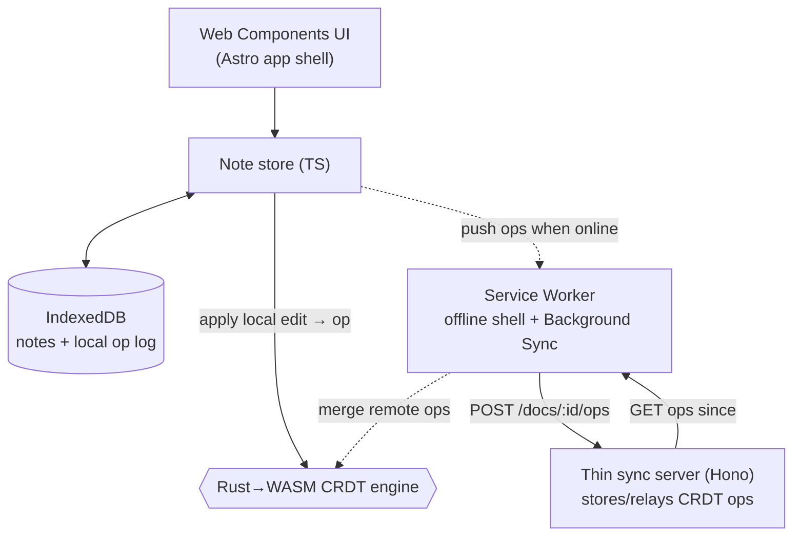

## The shape of the system

OfflineNotes คือ **ข้อมูลที่ client เป็นเจ้าของ, merge ด้วย WASM CRDT, ส่งต่อโดย server บาง ๆ**

**client คือ source of truth** ทุก edit ถูก apply ในเครื่องก่อน: note store ส่งมันไปให้ **WASM CRDT engine** ซึ่งแปลงมันเป็น **op** แล้วอัปเดต document ที่อยู่ใน memory; op และ state ใหม่ persist ลง **IndexedDB** จากนั้น UI re-render จากข้อมูลในเครื่อง **ไม่มีขั้นตอนไหนแตะเครือข่ายเลย** — แอปใช้งาน offline ได้เต็มที่ เพราะ offline คือเส้นทางหลัก ไม่ใช่ทางสำรอง

sync เป็น **การกระทบยอดเบื้องหลัง (background reconciliation)** ไม่ใช่ dependency พอมีเน็ต client จะ **push** op ใหม่ของมันไปที่ server บาง ๆ และ **pull** op ที่อุปกรณ์อื่น push มา; WASM engine จะ **merge** พวกมันเข้ากับ document ในเครื่อง เพราะการ merge เป็นแบบ conflict-free (นั่นคือสิ่งที่ CRDT รับประกัน) สองอุปกรณ์ที่แก้โน้ตเดียวกันตอนที่ทั้งคู่ offline จะ converge ไปที่ผลลัพธ์ *เดียวกัน* เมื่อ sync — โดยไม่มี prompt "อยากเก็บเวอร์ชันไหน?" เลยสักครั้ง

## Why this shape

- **Local-first ไม่ใช่ offline-as-error** การอ่านและเขียนวิ่งไปที่ IndexedDB ดังนั้นความ responsive และ availability ของแอปไม่เคยขึ้นอยู่กับเครือข่าย แอป server-first ที่มี "offline mode" กลับหัวเรื่องนี้แล้วต้องฝืนมันไปตลอด
- **CRDT สำหรับ merge ไม่ใช่ last-write-wins** LWW ทิ้ง edit ของอุปกรณ์หนึ่งไปเงียบ ๆ CRDT คือ data structure ที่การ merge เป็นแบบ *commutative, associative และ idempotent* — apply op ชุดเดียวกันในลำดับใดก็ได้ กี่ครั้งก็ได้ แล้วทุก replica converge นี่คือทางเดียวที่การแก้ไข offline พร้อมกันจะ merge ได้โดยไม่ต้องมีตัวกลางคอยตัดสิน
- **WASM สำหรับ engine** logic การ merge ต้องเหมือนกันและถูกต้องในทุก client; เขียนมันครั้งเดียวด้วย Rust แล้ว compile เป็น WASM ให้ core ที่ portable, เร็ว และผ่านการทดสอบมาอย่างดีเพียงตัวเดียว แทนที่จะ reimplement ในแต่ละ client แบบเพี้ยนกันเล็ก ๆ น้อย ๆ
- **server บางโดยตั้งใจ** มันเก็บและส่งต่อ CRDT op แบบ opaque; มันไม่เคย merge, ไม่เคยเป็นเจ้าของความจริง และเปลี่ยนไปใช้ transport แบบ peer-to-peer ได้โดยไม่ต้องแตะ data model ของ client

ต้นทุนมีจริง: CRDT พก metadata ติดตัว (มันโตขึ้นตามประวัติการแก้ไขถ้าไม่ compact), ขอบเขต WASM ต้อง marshal ข้อมูลอย่างระมัดระวัง และ "eventually consistent" หมายความว่าอุปกรณ์อาจแสดงข้อมูลเก่าอยู่ครู่หนึ่งก่อน sync มีหลาย module อยู่เพื่อจัดการเรื่องพวกนี้โดยเฉพาะ

## The pieces

- **Web Components UI + Astro shell** — `<note-list>`, `<note-editor>`, `<sync-status>`; Astro build และ host แอปที่ติดตั้งได้
- **IndexedDB** — source of truth ในเครื่อง: โน้ตและ op log ของมัน
- **Rust→WASM CRDT engine** — `apply_local(edit) → op`, `merge(remote_ops)`, `text()`; LWW register สำหรับ field + sequence CRDT สำหรับ body
- **Service Worker** — precache shell สำหรับใช้งาน offline และขับเคลื่อน Background Sync
- **Thin sync server (Hono)** — `POST /docs/:id/ops`, `GET /docs/:id/ops?since=`; เก็บและส่งต่อ op เท่านั้น ไม่มีอย่างอื่น

## Verify

คุณพร้อมไปต่อเมื่อตอบสิ่งเหล่านี้ด้วยคำพูดของคุณเองได้:

- ไล่เส้นทางของ edit หนึ่งครั้งจากการกดปุ่มไปจนถึง IndexedDB โดยปิดเครือข่าย WASM CRDT อยู่ตรงไหนในเส้นทางนั้น และทำไมมันถึงรัน *ก่อน* การ sync ใด ๆ?
- สองอุปกรณ์แก้โน้ตเดียวกันตอน offline แล้วทั้งคู่กลับมา online ทำไมมันถึง converge ไปที่โน้ตเดียวกัน และ property ไหนของ CRDT ที่รับประกันมัน?
- ทำไม sync server ถึงถูกเรียกว่า "thin"? มันตั้งใจ *ไม่ทำ* อะไรที่ backend แบบ server-first จะทำ?
- ยกตัวอย่างต้นทุนจริงสองอย่างที่ architecture นี้ต้องจ่าย แต่แอปโน้ตแบบ server-first ธรรมดาเลี่ยงได้

ต่อไป [prerequisites](/offlinenotes/th/introduction/prerequisites/) จะเตรียมเครื่องคุณให้พร้อม
