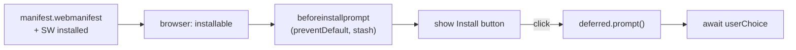

Service Worker ทำให้ OfflineNotes โหลด offline ได้ บทนี้ทำให้ **install ได้**: manifest บอก browser ว่านี่คือ app, `beforeinstallprompt` ที่ดักจับไว้ให้เราเสนอ install ในเงื่อนไขของเราเอง, และ DevTools Application panel ยืนยันว่าทุกอย่างทำงานได้โดยปิด network

## สิ่งที่จะสร้าง

สามชิ้นที่เปลี่ยน site ที่ cache ไว้ให้กลายเป็น app ที่ install แล้ว:

- **web app manifest** — name, icon, `start_url`, `display: standalone`, และ theme color สี teal ที่ link มาจาก page head
- **install flow แบบกำหนดเอง** — ดัก `beforeinstallprompt`, เก็บ event ไว้, แสดงปุ่ม "Install" ของเราเอง, แล้ว trigger native prompt ตอนคลิก
- **การ verify** — Manifest และ Service Workers view ใน Application panel บวกกับ Offline throttle เพื่อพิสูจน์ความ install ได้และการเปิด offline



## ทำไม

ความ install ได้คือ **contract ที่ browser บังคับใช้**: browser จะเสนอ install เฉพาะ site ที่มี manifest ถูกต้อง (พร้อม field และ icon ที่ต้องมี) *และ* มี Service Worker ที่ควบคุม page อยู่ เราทำครึ่งหลังไปแล้วบทที่แล้ว; manifest คือครึ่งแรก การทำให้เข้า contract ยังเป็น audit ที่มีประโยชน์ด้วย — ถ้า app install ได้ ก็แปลว่า offline ได้จริง เพราะ browser ตรวจแล้ว

เราดัก `beforeinstallprompt` แทนที่จะปล่อยให้ browser แสดง default mini-infobar เพราะ **timing และ placement เป็นการตัดสินใจเชิง product** การยิง install prompt ทันทีที่ผู้มาเยือนครั้งแรก landing คือทางที่เร็วที่สุดที่จะโดนปัดทิ้งตลอดกาล การเรียก `preventDefault()` และเก็บ event ไว้ทำให้เราโผล่ install ตรงจุดที่สมเหตุสมผล — ข้าง ๆ คำใบ้ว่า "works offline" หลังจาก user ได้เขียน note จริง ๆ แล้ว — และ event ที่เก็บไว้ยัง trigger native prompt *ตัวจริง* ได้เมื่อพวกเขาคลิก

ข้อจำกัดที่ตรงไปตรงมา: `beforeinstallprompt` เป็น feature ของ Chromium และจะไม่ fire ในทุก browser (iOS Safari install ผ่าน Share sheet แทน) และจะ fire เฉพาะเมื่อเข้าเกณฑ์และ app ยังไม่ถูก install ดังนั้นปุ่มแบบกำหนดเองคือ progressive enhancement — มีเมื่อ platform เสนอให้ ไม่มีเมื่อ platform ไม่เสนอ ไม่เคยเป็น dependency ที่ขาดไม่ได้

## ข้อดีข้อเสีย

**ดัก `beforeinstallprompt` เพื่อทำปุ่มแบบกำหนดเอง เทียบกับ default prompt ของ browser**

- **Pros:** คุณเลือกได้ว่าจะถามเมื่อไรและตรงไหน ผูกกับจังหวะที่ user เห็นคุณค่า และซ่อนได้เมื่อ install แล้ว — อัตราตอบรับสูงกว่า banner ที่โผล่มาโดยไม่มีใครขอมาก
- **Cons:** Chromium-only; คุณต้องจัดการ browser ที่ event ไม่เคย fire และคุณเป็นเจ้าของ lifecycle ของปุ่มเอง (แสดง, ซ่อนตอน install, ซ่อนตอนปัด)

**PWA ที่ install เป็น standalone เทียบกับการอยู่เป็น browser tab**

- **Pros:** มี window และ icon ของตัวเอง ไม่มี address bar เปิดจาก home screen หรือ dock ได้ — ให้ความรู้สึกเหมือน native notes app ที่ project นี้เลียนแบบอยู่
- **Cons:** user ต้อง opt in เพื่อ install, update ไหลผ่าน cache-versioning ของ Service Worker (ไม่ใช่ app store) และ standalone mode ซ่อน affordance ของ browser ที่ user บางคนพึ่งพา

## ติดตั้ง

### 1. `apps/web/public/manifest.webmanifest`

เสิร์ฟที่ `/offlinenotes/manifest.webmanifest` `start_url` และ `scope` รวม base path ไว้เพื่อให้ app ที่ install แล้วเปิดไปที่ตำแหน่งที่ถูกต้อง theme color คือสี teal ของ project

```json
{
  "name": "OfflineNotes",
  "short_name": "OfflineNotes",
  "description": "Local-first markdown notes that work fully offline.",
  "start_url": "/offlinenotes/",
  "scope": "/offlinenotes/",
  "display": "standalone",
  "background_color": "#ffffff",
  "theme_color": "#0D9488",
  "icons": [
    { "src": "/offlinenotes/icons/icon-192.png", "sizes": "192x192", "type": "image/png" },
    { "src": "/offlinenotes/icons/icon-512.png", "sizes": "512x512", "type": "image/png" },
    {
      "src": "/offlinenotes/icons/icon-maskable-512.png",
      "sizes": "512x512",
      "type": "image/png",
      "purpose": "maskable"
    }
  ]
}
```

### 2. `apps/web/src/layouts/AppLayout.astro`

link manifest และ set theme color ใน page head เพื่อให้ browser อ่านได้

```astro
<head>
  <meta name="viewport" content="width=device-width, initial-scale=1" />
  <link rel="manifest" href="/offlinenotes/manifest.webmanifest" />
  <meta name="theme-color" content="#0D9488" />
  <link rel="icon" href="/offlinenotes/favicon.svg" />
</head>
```

### 3. `apps/web/src/install-prompt.ts`

ดัก event, เผยปุ่มออกมา, แล้วขับ native prompt ตอนคลิก type `BeforeInstallPromptEvent` ไม่มีใน DOM lib เราจึง declare shape ที่เราใช้ไว้เอง

```ts
interface BeforeInstallPromptEvent extends Event {
  prompt(): Promise<void>;
  userChoice: Promise<{ outcome: 'accepted' | 'dismissed' }>;
}

let deferred: BeforeInstallPromptEvent | null = null;

export function wireInstallPrompt(button: HTMLButtonElement) {
  button.hidden = true;

  window.addEventListener('beforeinstallprompt', (event) => {
    // Stop the browser's default mini-infobar; keep the event for later.
    event.preventDefault();
    deferred = event as BeforeInstallPromptEvent;
    button.hidden = false;
  });

  button.addEventListener('click', async () => {
    if (!deferred) return;
    await deferred.prompt();
    const { outcome } = await deferred.userChoice;
    console.log(`install ${outcome}`);
    // A prompt can only be used once; drop it and hide the button.
    deferred = null;
    button.hidden = true;
  });

  // Already installed (or just accepted): make sure the button is gone.
  window.addEventListener('appinstalled', () => {
    deferred = null;
    button.hidden = true;
  });
}
```

### 4. `apps/web/src/main.ts`

ต่อสายปุ่มไปพร้อมกับการ register Service Worker

```ts
import { registerServiceWorker } from './register-sw';
import { wireInstallPrompt } from './install-prompt';

registerServiceWorker();

const installBtn = document.querySelector<HTMLButtonElement>('#install');
if (installBtn) wireInstallPrompt(installBtn);
```

## ตรวจสอบผล

ความ install ได้ต้องใช้ manifest และ Service Worker จริง จึงต้องทดสอบกับ build ไม่ใช่ dev server:

```bash
pnpm --filter web build
pnpm --filter web preview
```

เปิด preview URL จากนั้นใน DevTools → Application:

- **Manifest** — field render ออกมา, icon resolve, และไม่มี error "installability"; ข้อความอย่าง *"Page is installable"* (หรือ install icon ใน address bar) ยืนยันว่าเข้า contract แล้ว
- **Service Workers** — worker อยู่ในสถานะ *activated*
- คลิก install icon ใน address bar (หรือปุ่ม **Install** แบบกำหนดเองของคุณ); app เปิดใน standalone window ของตัวเอง

ตอนนี้ยืนยันว่าเปิดได้โดยไม่มี network ใน DevTools → Network set throttle เป็น **Offline** แล้วเปิด app ที่ install แล้วใหม่ (หรือ reload):

```text
Network throttle: Offline
Relaunch installed app → OfflineNotes opens, notes load from IndexedDB
```

สุดท้าย build ให้สะอาดเป็นด่านสุดท้าย:

```bash
pnpm --filter web build
# ✓ built in <time>
```

**ตรวจสอบความเข้าใจ:**

1. เงื่อนไขสองอย่างใดที่ต้องเป็นจริงก่อน browser จะถือว่า app install ได้?
2. ทำไมต้องเรียก `preventDefault()` บน `beforeinstallprompt` แล้วเก็บ event ไว้แทนที่จะปล่อยให้ default banner แสดง?
3. ทำไมคุณถึงใช้ prompt event ที่เก็บไว้ซ้ำสำหรับความพยายาม install ครั้งที่สองไม่ได้?
4. DevTools panel และ setting ใดที่ให้คุณพิสูจน์ว่า app ที่ *install แล้ว* เปิดได้โดยปิด network?

## สรุป

ตอนนี้ OfflineNotes เป็น PWA จริงแล้ว: manifest ประกาศว่านี่เป็น app, `beforeinstallprompt` ที่ดักจับไว้เสนอ install ในเงื่อนไขของเรา, และ Application panel ยืนยันว่า install และเปิด offline ได้เต็มรูปแบบ ทั้ง client — data, code, และ shell — รันได้โดยไม่มี network สิ่งที่ยังทำไม่ได้คือการ *แชร์* edit ระหว่าง device ต่อไป [The Sync Server →](/offlinenotes/th/sync-server/) สร้าง Hono backend แบบบางที่เก็บและ relay CRDT op ที่นั่งอยู่ใน outbox
