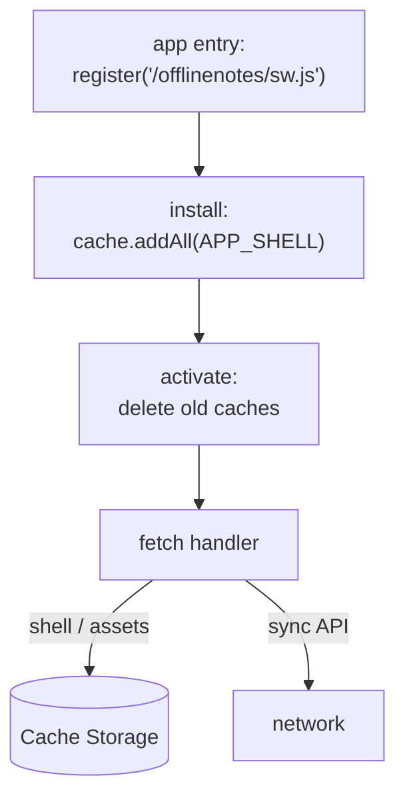

data อยู่ใน IndexedDB แล้ว ดังนั้น note รอด offline ได้ — แต่ลอง reload page ตอนไม่มี network ดูสิ คุณจะเจอไดโนเสาร์ของ browser เพราะ HTML, JS, และ WASM มาจาก server **Service Worker** แก้เรื่องนี้ด้วยการ cache app shell เอาไว้เอง เราเขียนเอง (ไม่ใช้ Workbox) เพื่อให้เห็นทุกบรรทัด

## สิ่งที่จะสร้าง

`apps/web/public/sw.js`, Service Worker ที่มี lifecycle handler สามตัว:

- **`install`** — เปิด cache แบบมี version แล้ว precache app shell (route HTML, manifest, icon, และ built entry)
- **`activate`** — ลบ cache จาก version ก่อนหน้าเพื่อไม่ให้ asset เก่าค้างอยู่ตลอดกาล
- **`fetch`** — เสิร์ฟ shell และ static asset แบบ **cache-first**; ปล่อยให้ sync API วิ่งไป **network** เสมอ

บวกกับการ register หนึ่งบรรทัดจาก app entry เพื่อให้ browser install ให้



## ทำไม

Service Worker คือ **network proxy ที่คงอยู่ข้าม page load** เมื่อ install แล้ว จะนั่งอยู่ระหว่าง app กับ network และตอบ `fetch` event แม้ในตอนที่เพิ่งเปิด tab ขึ้นมาเย็น ๆ โดยปิดสัญญาณ นั่นคือครึ่งที่ขาดหายไปของ offline-first: IndexedDB ทำให้ *data* เป็น local; Service Worker ทำให้ *code ที่ render data นั้น* เป็น local ด้วย ถ้าไม่มีทั้งสอง "offline" จะใช้ได้ก็ต่อเมื่อ user ไม่เคยปิด tab เลย

cache-first คือ default ที่ถูกต้อง *สำหรับ shell* พอดี เพราะ shell คือ build ที่เราคุม version เอง — hashed asset ไม่เคยเปลี่ยนภายใต้ URL หนึ่ง ๆ ดังนั้นการ return copy จาก cache ไม่ใช่แค่เร็วกว่า แต่ถูกต้องด้วย ส่วน sync API ตรงข้ามกัน: คุณค่าทั้งหมดอยู่ที่ op สด ๆ จาก device อื่น จึงต้องไปถึง network และไม่ควรตอบจาก cache ที่ค้างเก่า การแยกสองอย่างนี้ตาม request kind แทนที่จะ cache ทุกอย่าง คือสิ่งที่ทำให้ app ทั้งทันทีและถูกต้อง

เราข้าม Workbox อย่างตั้งใจ ใน production คุณคงใช้ และ Astro สร้าง precache manifest ของ hashed file ตอน build ได้ ที่นี่เป้าหมายคือการ *เข้าใจ* lifecycle — install, activate, fetch, และ cache versioning — ไม่ใช่การ abstract ออกไป

## ข้อดีข้อเสีย

**cache-first สำหรับ shell เทียบกับ network-first ที่มี cache fallback**

- **Pros:** โหลดทันทีและ offline ได้จริง — cached shell render ก่อนที่จะปรึกษา network ด้วยซ้ำ; connection ที่กระท่อนกระแท่นไม่เคยหน่วง startup
- **Cons:** shell ที่เพิ่ง deploy ใหม่จะยังไม่ถูกเห็นจนกว่า SW จะ update และ cache version เลื่อนขึ้น; คุณต้องจัดการ versioning อย่างตั้งใจ ไม่งั้น user รัน code เก่า

**เขียน SW เอง เทียบกับ Workbox / precache manifest ที่ generate มา**

- **Pros:** ทุกพฤติกรรม explicit และ debug ได้; ไม่มีอะไรซ่อน เหมาะสำหรับการเรียนรู้ platform primitive
- **Cons:** คุณดูแล shell list และ cache-busting เอง; hashed asset filename เปลี่ยนทุก build ดังนั้น static list ต้องพึ่ง runtime caching (ด้านล่าง) เพื่อให้ครบถ้วน

## ติดตั้ง

### 1. `apps/web/public/sw.js`

ไฟล์ใน `public/` ถูกเสิร์ฟที่ site root ดังนั้นเมื่อมี `base: '/offlinenotes'` ไฟล์จะไปตกที่ `/offlinenotes/sw.js` เลื่อน `CACHE` ขึ้นทุกครั้งที่ shell เปลี่ยน — `install` ของ version ใหม่จะ recache และ `activate` จะ evict ตัวเก่าออก

```js
// apps/web/public/sw.js
const CACHE = 'offlinenotes-v1';
const BASE = '/offlinenotes/';

// The minimal shell needed to boot the app offline. Hashed build assets
// (/_astro/*) are cached at runtime by the fetch handler below.
const APP_SHELL = [
  BASE,
  `${BASE}index.html`,
  `${BASE}manifest.webmanifest`,
  `${BASE}favicon.svg`,
  `${BASE}icons/icon-192.png`,
  `${BASE}icons/icon-512.png`,
];

self.addEventListener('install', (event) => {
  event.waitUntil(
    caches.open(CACHE).then((cache) => cache.addAll(APP_SHELL)),
  );
  // Activate this SW as soon as it finishes installing.
  self.skipWaiting();
});

self.addEventListener('activate', (event) => {
  event.waitUntil(
    caches.keys().then((keys) =>
      Promise.all(keys.filter((k) => k !== CACHE).map((k) => caches.delete(k))),
    ),
  );
  // Take control of open pages without requiring a reload.
  self.clients.claim();
});

self.addEventListener('fetch', (event) => {
  const { request } = event;

  // Only handle same-origin GETs. The sync API (cross-origin, and often
  // POST) falls through to the network untouched.
  if (request.method !== 'GET') return;
  const url = new URL(request.url);
  if (url.origin !== self.location.origin) return;

  // Cache-first: serve from cache, else fetch and cache the response
  // (this fills in hashed /_astro/* assets on first visit).
  event.respondWith(
    caches.match(request).then((cached) => {
      if (cached) return cached;
      return fetch(request).then((response) => {
        if (response.ok && response.type === 'basic') {
          const copy = response.clone();
          caches.open(CACHE).then((cache) => cache.put(request, copy));
        }
        return response;
      });
    }),
  );
});
```

### 2. `apps/web/src/register-sw.ts`

register จาก app entry โดยกันไว้สำหรับกรณีที่ support และ scope worker ให้อยู่กับ app base การ register หลัง `load` ช่วยเลี่ยงการแย่ง bandwidth กับ first paint ของ page

```ts
export function registerServiceWorker() {
  if (!('serviceWorker' in navigator)) return;
  window.addEventListener('load', () => {
    navigator.serviceWorker
      .register(`${import.meta.env.BASE_URL}sw.js`, {
        scope: import.meta.env.BASE_URL, // '/offlinenotes/'
      })
      .then((reg) => console.log('SW registered:', reg.scope))
      .catch((err) => console.error('SW registration failed:', err));
  });
}
```

### 3. `apps/web/src/main.ts`

เรียกหนึ่งครั้งจาก entry ที่ boot app

```ts
import { registerServiceWorker } from './register-sw';

registerServiceWorker();
```

## ตรวจสอบผล

Service Worker ควบคุมเฉพาะ page ที่เสิร์ฟผ่าน `https` หรือ `localhost` และดู caching ได้ง่ายที่สุดเมื่อทดสอบกับ build จริง build แล้ว preview:

```bash
pnpm --filter web build
pnpm --filter web preview   # serves the built site on localhost
```

เปิด preview URL จากนั้นใน DevTools → Application:

- **Service Workers** — worker แสดง *activated and running*, scope `/offlinenotes/`
- **Cache Storage** — cache `offlinenotes-v1` แสดง shell URL; reload หนึ่งครั้งแล้ว asset `/_astro/*` จะโผล่มาด้วย

ตอนนี้พิสูจน์ offline จริง ใน DevTools → Network สลับ throttle เป็น **Offline** แล้ว reload:

```text
Network throttle: Offline
Reload → the app still renders (served from Cache Storage)
```

เลื่อน `CACHE` เป็น `offlinenotes-v2`, rebuild, reload สองครั้ง แล้วยืนยันว่า cache เก่าหายไปจาก Cache Storage — นั่นคือ `activate` เก็บกวาด

**ตรวจสอบความเข้าใจ:**

1. ทำไม IndexedDB อย่างเดียวถึงไม่ทำให้ app ทำงาน offline ได้หลังจากปิดแล้วเปิด tab ใหม่?
2. `install` ทำอะไร และทำไมต้องห่อ `cache.addAll(...)` ไว้ใน `event.waitUntil`?
3. ทำไม cache-first ถึงถูกต้องสำหรับ hashed build asset แต่ผิดสำหรับ sync API?
4. อะไรจะพังถ้าคุณไม่เคยเลื่อน `CACHE` และ `activate` handler ทำอะไรกับ version เก่า?

## สรุป

ตอนนี้ Service Worker ที่เราเขียนเอง precache shell ตอน `install`, evict cache ที่ค้างเก่าตอน `activate`, และเสิร์ฟ app แบบ cache-first ส่วน sync API ยังไปถึง network ได้ — ดังนั้น OfflineNotes โหลดได้โดยปิด network เต็มที่ แอปรันได้ แต่ browser ยังไม่เสนอให้ *install* ลง home screen ต่อไป [Installable PWA →](/offlinenotes/th/service-worker/installable-pwa/) เพิ่ม manifest และ install prompt แล้วยืนยันการใช้ offline เต็มรูปแบบใน DevTools
