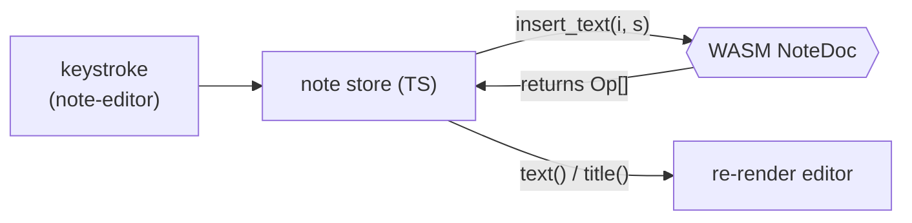

คุณสร้าง CRDT ไว้แล้วใน [A CRDT in Rust →](/offlinenotes/th/crdt-rust/) และสร้าง store แบบ typed ไว้ใน [IndexedDB Foundation →](/offlinenotes/th/indexeddb/) บทนี้เชื่อมสองสิ่งนั้นเข้าด้วยกัน: note store boot WASM module ขึ้นมา ถือ `NoteDoc` ที่ยังมีชีวิตอยู่ แล้วแปลงทุกการกดคีย์ให้เป็น **op**

## สิ่งที่จะสร้าง

note store (`store.ts`) ที่เป็นเจ้าของ WASM CRDT สำหรับ note ที่เปิดอยู่ และเปิด edit method ให้สามตัว — `setTitle`, `insertText`, `deleteText` — ที่เรียกเข้า `NoteDoc` เก็บ op ที่ engine ส่งกลับมา แล้ว re-render UI จาก `title()` และ `text()`

การกลับด้านที่เป็นหัวใจ: UI ไม่เคยแก้ string ตรง ๆ แต่ขอให้ CRDT apply edit และ CRDT คือผู้มีอำนาจตัดสินเพียงหนึ่งเดียวว่าตอนนี้ document พูดว่าอะไร op คือผลพลอยได้ที่เราจะ persist และ sync ในบทถัดไป ตรงนี้เราแค่ทำให้ไหลได้ก่อน



## ทำไม

CRDT engine คือแหล่งความถูกต้องเพียงหนึ่งเดียว ทุก device รัน Rust code *ตัวเดียวกัน* ที่ compile เป็น WASM ดังนั้น edit ที่ apply บน client หนึ่งจะผลิต op ที่มีความหมายเหมือนกันเป๊ะบนอีก client หนึ่ง ถ้า UI แก้ JavaScript string ธรรมดาแล้วค่อยส่งให้ CRDT *ทีหลัง* ทั้งสอง representation อาจ drift ออกจากกันได้ — และ drift นี่แหละคือสิ่งที่ CRDT ถูกสร้างมาเพื่อป้องกันโดยตรง

การ apply edit ผ่าน `NoteDoc` ก่อนยังให้ op มาฟรี ๆ ด้วย `insert_text` ไม่ได้แค่แก้ document; แต่ *return* op ที่อธิบายการแก้นั้นด้วย ค่าที่ return มานั้นคือ atom ที่เราเก็บลง outbox แล้ว push ไป server การผลิต state และผลิต sync record ในการเรียกครั้งเดียวหมายความว่าทั้งสองจะไม่มีวันขัดแย้งกันได้

## ข้อดีข้อเสีย

**op เป็นค่าที่ทุก edit return กลับมา เทียบกับ diff state ทีหลัง**

- **Pros:** op นั้นแม่นยำและรักษาเจตนาไว้ครบ — insert "x" ที่ position 3 คือ `ins` op หนึ่งตัว ไม่ใช่การเดาที่สร้างขึ้นใหม่จากการเทียบสอง string ไม่มี diff algorithm ให้พลาดแบบเนียน ๆ
- **Cons:** ทุกเส้นทางของ edit ต้องผ่าน CRDT method; คุณลัดขั้นตอนไป set `textarea.value` ตรง ๆ ไม่ได้ ไม่งั้น op log กับ text ที่มองเห็นจะหลุด step กัน

**boot WASM ครั้งเดียวแล้วถือ `NoteDoc` ที่มีชีวิต เทียบกับสร้างใหม่จาก snapshot ทุกครั้งที่ edit**

- **Pros:** edit เป็นการเรียก method ใน memory ที่ราคาถูก; engine เก็บ index ภายในไว้ให้พร้อมใช้เสมอ
- **Cons:** document ที่มีชีวิตคือ mutable state ที่คุณต้องดูแลอย่างระวัง — หนึ่ง `NoteDoc` ต่อหนึ่ง note ที่เปิดอยู่ และคุณต้องไม่ทำหายโดยไม่ persist (บทถัดไปจะปิดช่องว่างนั้น)

## ติดตั้ง

### 1. `apps/web/src/store.ts`

boot WASM module แค่ครั้งเดียวเป๊ะ ๆ แล้วเก็บ `NoteDoc` ของ note ที่เปิดอยู่ไว้ใน memory ตัว `init` default export จะ load และ instantiate ไฟล์ `.wasm`; คุณต้อง `await` ก่อนสร้าง exported type ใด ๆ

```ts
import init, { NoteDoc } from '../../../crates/crdt/pkg/crdt.js';
import { getMeta, setMeta } from './db';

// The op wire format, shared with the outbox and the sync server.
export type ActorId = string;
export type OpId = [counter: number, actor: ActorId];
export type Op =
  | { t: 'title'; value: string; ts: OpId }
  | { t: 'ins'; id: OpId; after: OpId | null; ch: string }
  | { t: 'del'; id: OpId };

let wasmReady: Promise<void> | null = null;

/** Load and instantiate the WASM module exactly once, however often it's called. */
function ensureWasm(): Promise<void> {
  wasmReady ??= init().then(() => undefined);
  return wasmReady;
}

/** A stable per-device id; the CRDT uses it to tie-break and to stamp op ids. */
async function getActorId(): Promise<ActorId> {
  let actorId = await getMeta<ActorId>('actorId');
  if (!actorId) {
    actorId = crypto.randomUUID();
    await setMeta('actorId', actorId);
  }
  return actorId;
}
```

### 2. `apps/web/src/store.ts` — the open-note store

ห่อ `NoteDoc` ที่มีชีวิตไว้ใน object เล็ก ๆ ทุก edit method จะ return op ออกมาเพื่อให้ผู้เรียก (บทถัดไป) เอาไป persist ได้; `onChange` จะ fire หลังทุก edit เพื่อให้ editor re-render จาก CRDT state

```ts
// serde-wasm-bindgen may hand back a single op or an array; normalise to Op[].
function toOps(value: unknown): Op[] {
  return Array.isArray(value) ? (value as Op[]) : [value as Op];
}

export interface OpenNote {
  readonly id: string;
  setTitle(title: string): Op[];
  insertText(index: number, s: string): Op[];
  deleteText(index: number, len: number): Op[];
  title(): string;
  text(): string;
}

export async function openBlankNote(
  id: string,
  onChange: () => void,
): Promise<OpenNote> {
  await ensureWasm();
  const actorId = await getActorId();
  const doc = new NoteDoc(actorId);

  return {
    id,
    setTitle(title) {
      const ops = toOps(doc.set_title(title));
      onChange();
      return ops;
    },
    insertText(index, s) {
      const ops = toOps(doc.insert_text(index, s));
      onChange();
      return ops;
    },
    deleteText(index, len) {
      const ops = toOps(doc.delete_text(index, len));
      onChange();
      return ops;
    },
    title: () => doc.title(),
    text: () => doc.text(),
  };
}
```

### 3. `apps/web/src/components/note-editor.ts`

editor ไม่เคยแก้ string ของตัวเอง แต่คำนวณช่วงที่เปลี่ยน เรียก store แล้ววาดกลับสิ่งที่ CRDT รายงานมา snippet นี้แสดง title และการแทนที่ทั้งค่าสำหรับ body — การลดการแทนที่ทั้งก้อนให้เป็น insert/delete ช่วยให้การต่อสายซื่อตรงระหว่างที่เรากำลังเรียนรู้

```ts
import type { OpenNote } from '../store';

export class NoteEditor extends HTMLElement {
  private note!: OpenNote;
  private titleEl!: HTMLInputElement;
  private bodyEl!: HTMLTextAreaElement;

  bind(note: OpenNote) {
    this.note = note;
    this.titleEl.value = note.title();
    this.bodyEl.value = note.text();

    this.titleEl.addEventListener('input', () => {
      this.note.setTitle(this.titleEl.value);
    });

    this.bodyEl.addEventListener('input', () => {
      // Replace the whole body: delete the old text, insert the new.
      const previous = this.note.text();
      if (previous.length) this.note.deleteText(0, previous.length);
      if (this.bodyEl.value.length) this.note.insertText(0, this.bodyEl.value);
    });
  }

  /** Called by the store's onChange: repaint from CRDT truth. */
  render() {
    if (this.titleEl.value !== this.note.title()) this.titleEl.value = this.note.title();
    if (this.bodyEl.value !== this.note.text()) this.bodyEl.value = this.note.text();
  }
}

customElements.define('note-editor', NoteEditor);
```

## ตรวจสอบผล

ต่อสาย store เข้ากับ page แล้วขับจาก browser console ก่อนอื่นยืนยันว่า WASM package ถูก build แล้ว:

```bash
pnpm --filter web build:wasm   # runs: wasm-pack build --target web (crates/crdt → pkg)
ls crates/crdt/pkg/crdt.js
# crates/crdt/pkg/crdt.js
```

จากนั้นเมื่อ dev server ทำงานอยู่ ลองขับ store ใน DevTools console:

```js
const note = await window.__store.openBlankNote('n1', () => {});
note.setTitle('Groceries');
const ops = note.insertText(0, 'milk');
console.log(note.title(), '/', note.text());
// Groceries / milk
console.log(JSON.stringify(ops));
// [{"t":"ins","id":[1,"<actor>"],"after":null,"ch":"m"}, ... ]
```

สุดท้าย รัน app build เพื่อพิสูจน์ว่า WASM import resolve ผ่าน Vite ได้:

```bash
pnpm --filter web build
# ✓ built in <time>
```

**ตรวจสอบความเข้าใจ:**

1. ทำไม editor ถึงเรียก `insertText` แทนที่จะ set `textarea.value` แล้วอ่านกลับมาทีหลัง?
2. `insert_text` return อะไรกลับมานอกจากการแก้ document และทำไมค่าที่ return นั้นคือสิ่งที่เราสนใจมากที่สุด?
3. ทำไม `await init()` ต้องเสร็จก่อน `new NoteDoc(actorId)` — ถ้าไม่ทำจะเกิดอะไรขึ้น?
4. ทำไมถึงเก็บ `NoteDoc` ที่มีชีวิตไว้หนึ่งตัวใน memory แทนที่จะสร้างใหม่จาก state ที่เก็บไว้ทุกครั้งที่กดคีย์?

## สรุป

ตอนนี้ note store boot WASM CRDT ถือ `NoteDoc` ที่มีชีวิตหนึ่งตัวต่อ note ที่เปิดอยู่ และแปลงทุก edit ให้เป็น op ขณะที่ UI render จาก `title()` และ `text()` op ไหลอยู่แต่ระเหยหายไป — ยังไม่มีอะไรถูก save เลย ต่อไป [Persisting ops →](/offlinenotes/th/wiring-wasm/persisting-ops/) จะเขียน snapshot ลง IndexedDB และ queue แต่ละ op ไว้ใน outbox เพื่อให้การ reload กู้ document กลับมาได้เป๊ะ ๆ
