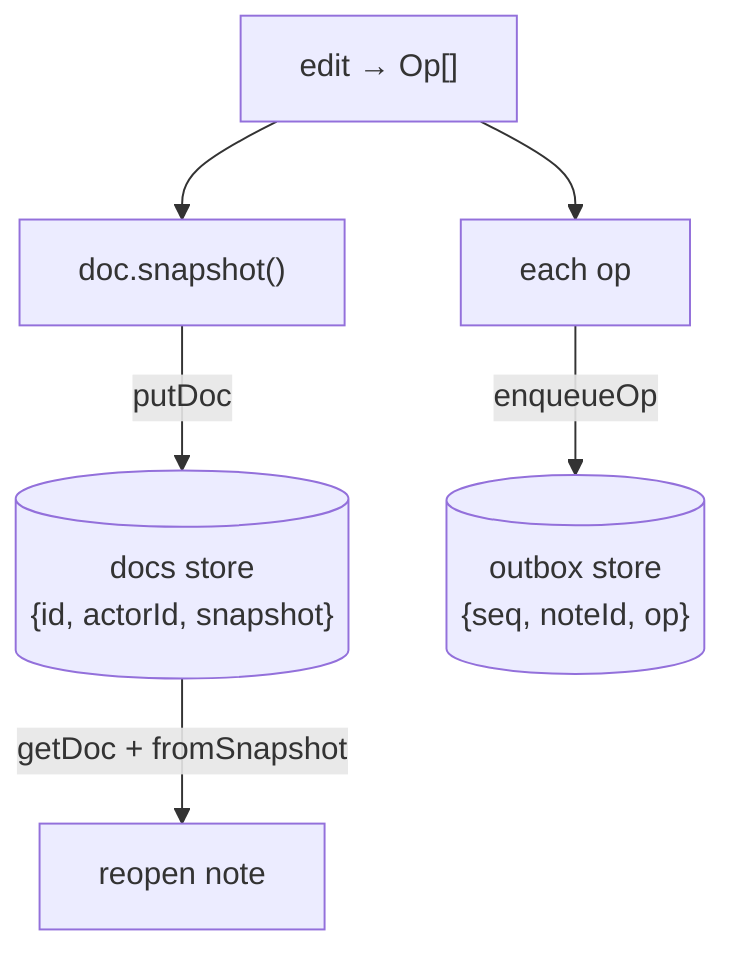

ตอนนี้ op ไหลออกจากทุก edit แล้ว แต่มันหายไปตอน reload บทนี้ทำให้ document คงทน: **snapshot** ของ CRDT ทั้งก้อนไปที่ `docs` store, แต่ละ **op** ถูก queue ไว้ใน `outbox`, และการเปิด note ซ้ำจะสร้างมันขึ้นใหม่ด้วย `NoteDoc.fromSnapshot`

## What we're building

write path สองเส้นและ read path หนึ่งเส้น ทั้งหมดผ่าน typed `db.ts` wrapper จาก IndexedDB module:

- **ทุกครั้งที่ edit** — persist snapshot ใหม่ไปที่ `docs` (state ที่เป็นทางการ) และ append op ที่ return มาไปที่ `outbox` (queue ที่ยังไม่ sync) แล้ว refresh projection ของ `notes` list
- **ตอนเปิด** — อ่าน record ของ note จาก `docs` แล้วสร้าง document ที่มีชีวิตขึ้นใหม่ด้วย `NoteDoc.fromSnapshot(actorId, snapshot)`

editor ยังคง render จาก `title()` และ `text()` เหมือนเดิมเป๊ะ; มันไม่รู้เลยว่ามีการ persist เกิดขึ้น



## Why

เราเก็บ **สอง representation อย่างตั้งใจ** เพราะทั้งสองตอบคำถามที่ต่างกัน snapshot ตอบว่า "ตอนนี้ note นี้พูดว่าอะไร *เดี๋ยวนี้*?" — มันคือสิ่งที่เรา load เพื่อแสดง note ทันทีโดยไม่ต้อง replay ประวัติ ส่วน outbox ตอบว่า "ฉันแก้อะไรไปบ้างที่ server ยังไม่เห็น?" — มันคือ op stream เป๊ะ ๆ ที่เราจะ push ใน sync module

เราเก็บแค่ op log แล้ว replay มันได้ไหม? ได้ และดีไซน์แบบ pure event-sourced ก็ทำแบบนั้น แต่การ replay ทุก op ตั้งแต่ตอนสร้างเพื่อเปิด note จะช้าลงเรื่อย ๆ ทุกครั้งที่ edit และหัวใจของ local-first คือการเปิด note ต้องทันทีและ offline ได้ snapshot คือ cache ของ state ที่พับเก็บไว้แล้ว; outbox คือส่วนหางที่เรายังติดค้าง network อยู่ การเก็บทั้งสองคือทางสายกลางที่ practical: อ่านเร็ว *และ* มี sync record ที่แม่นยำ

`fromSnapshot` คือสิ่งที่ทำให้ snapshot เชื่อถือได้ เพราะมันสร้าง `NoteDoc` ขึ้นใหม่ด้วย actor id *ตัวเดียวกัน* และ counter ภายในเดิม edit ที่ทำหลัง reload จึงผลิต op ที่เข้าล็อกถูกที่ใน causal history เดียวกัน — note ที่กู้กลับมาแยกไม่ออกจาก note ที่ไม่เคยถูกปิดเลย

## Pros & cons

**persist snapshot ทุกครั้งที่ edit เทียบกับ persist แค่ op log**

- **Pros:** การเปิด note คือ `getDoc` หนึ่งครั้งและ `fromSnapshot` หนึ่งครั้ง — เวลาคงที่ ไม่มี replay อยู่รอด reload และการ restart browser
- **Cons:** snapshot พก CRDT metadata มาด้วย (tombstone จาก text ที่ลบไปแล้วจะไม่หดลงถ้าไม่มี compaction — ข้อควรระวังที่ตรงไปตรงมาจาก CRDT module) ดังนั้น blob ที่เก็บไว้จึงโตขึ้นตามประวัติการ edit

**outbox queue แยกต่างหาก เทียบกับ derive op ที่ยังไม่ sync ออกจาก snapshot ตอน push**

- **Pros:** outbox เป็น record แบบ explicit เรียงลำดับ และ append-only ของสิ่งที่ต้องส่งเป๊ะ ๆ; การ drain มันเรียบง่ายและเป็นมิตรกับ idempotent
- **Cons:** มันเป็น store ตัวที่สองที่ต้องรักษาให้ consistent กับ `docs` — write ทั้งสองควรเกิดพร้อมกัน ไม่งั้น crash ระหว่างสองอันอาจทำ op หลุดจาก queue ในขณะที่ยังคงอยู่ใน state

## Set it up

### 1. `apps/web/src/db.ts` — the accessors we rely on

พวกนี้มาจาก [IndexedDB Foundation →](/offlinenotes/th/indexeddb/) module; shape ต้องตรงตาม contract เป๊ะ ๆ key `seq` ของ `outbox` autoincrement เอง ดังนั้น `enqueueOp` จึงไม่ต้องส่ง key มา

```ts
import { openDB, type DBSchema } from 'idb';
import type { Op } from './store';

interface NotesDB extends DBSchema {
  notes: { key: string; value: { id: string; title: string; updatedAt: number } };
  docs: { key: string; value: { id: string; actorId: string; snapshot: unknown } };
  outbox: {
    key: number;
    value: { seq: number; noteId: string; op: Op };
    autoIncrement: true;
  };
  meta: { key: string; value: { key: string; value: unknown } };
}

const dbp = openDB<NotesDB>('offlinenotes', 1, {
  upgrade(db) {
    db.createObjectStore('notes', { keyPath: 'id' });
    db.createObjectStore('docs', { keyPath: 'id' });
    db.createObjectStore('outbox', { keyPath: 'seq', autoIncrement: true });
    db.createObjectStore('meta', { keyPath: 'key' });
  },
});

export async function putDoc(rec: { id: string; actorId: string; snapshot: unknown }) {
  return (await dbp).put('docs', rec);
}
export async function getDoc(id: string) {
  return (await dbp).get('docs', id);
}
export async function putNote(rec: { id: string; title: string; updatedAt: number }) {
  return (await dbp).put('notes', rec);
}
export async function enqueueOp(noteId: string, op: Op) {
  // seq is autoIncremented by IndexedDB; omit it from the value.
  return (await dbp).add('outbox', { noteId, op } as never);
}
```

### 2. `apps/web/src/store.ts` — persist on change

ขยาย store ให้ mutator save ก่อนที่จะ return helper ตัวเดียวพับ write สามอย่างเข้าด้วยกัน: snapshot ไป `docs`, op ไป `outbox`, projection ไป `notes` การห่อ edit และ persist ไว้ใน method เดียวช่วยให้ `docs` และ `outbox` เดินตรง step กัน

```ts
import init, { NoteDoc } from '../../../crates/crdt/pkg/crdt.js';
import { getDoc, putDoc, putNote, enqueueOp } from './db';

async function persist(id: string, actorId: string, doc: NoteDoc, ops: Op[]) {
  // snapshot() serialises the whole CRDT via serde-wasm-bindgen.
  await putDoc({ id, actorId, snapshot: doc.snapshot() });
  for (const op of ops) await enqueueOp(id, op);
  await putNote({ id, title: doc.title(), updatedAt: Date.now() });
}
```

### 3. `apps/web/src/store.ts` — open from snapshot

`openNote` อ่าน `docs`; ถ้ามี record อยู่ มันสร้างใหม่ด้วย `fromSnapshot` ไม่งั้นเริ่ม `NoteDoc` ใหม่สด ๆ ตอนนี้ edit method จะ `await persist(...)` ก่อน fire `onChange`

```ts
export async function openNote(id: string, onChange: () => void): Promise<OpenNote> {
  await ensureWasm();
  const actorId = await getActorId();

  const stored = await getDoc(id);
  const doc = stored
    ? NoteDoc.fromSnapshot(stored.actorId, stored.snapshot)
    : new NoteDoc(actorId);
  const docActor = stored?.actorId ?? actorId;

  const applied = async (ops: Op[]) => {
    await persist(id, docActor, doc, ops);
    onChange();
    return ops;
  };

  return {
    id,
    setTitle: (t) => toOps(doc.set_title(t)),        // then: applied(...)
    insertText: (i, s) => applied(toOps(doc.insert_text(i, s))) as unknown as Op[],
    deleteText: (i, n) => applied(toOps(doc.delete_text(i, n))) as unknown as Op[],
    title: () => doc.title(),
    text: () => doc.text(),
  };
}
```

> ตอนนี้ edit method เป็น async แล้ว (มัน await IndexedDB) ให้ editor `await note.insertText(...)` เพื่อไม่ให้การกดคีย์หายถ้าสอง edit แข่งกัน; IndexedDB write ถูก queue ไว้ แต่ `doc` ใน memory ของคุณต้องคงเป็นผู้มีอำนาจตัดสินลำดับ

## Verify

build WASM package และ app แล้วพิสูจน์ความคงทนด้วยมือ ใน DevTools console:

```js
const note = await window.__store.openNote('n1', () => {});
await note.insertText(0, 'buy milk');
await note.setTitle('Groceries');
// Reload the page (Cmd-R), then:
const again = await window.__store.openNote('n1', () => {});
console.log(again.title(), '/', again.text());
// Groceries / buy milk
```

ตรวจดู store ใน DevTools → Application → IndexedDB → `offlinenotes`:

```text
docs    → { id: "n1", actorId: "…", snapshot: {…} }
outbox  → { seq: 1, noteId: "n1", op: {…} }, { seq: 2, … }, …
notes   → { id: "n1", title: "Groceries", updatedAt: 173… }
```

จากนั้นรัน production build เพื่อยืนยันว่าทุกอย่าง type-check ผ่านและ bundle ได้:

```bash
pnpm --filter web build
# ✓ built in <time>
```

**ตรวจสอบความเข้าใจ:**

1. ทำไมถึงเก็บทั้ง snapshot ใน `docs` และ op ใน `outbox` แทนที่จะเก็บแค่อย่างใดอย่างหนึ่ง?
2. `NoteDoc.fromSnapshot(actorId, snapshot)` สร้างอะไรขึ้นใหม่ที่ `new NoteDoc(actorId)` สด ๆ จะไม่มี?
3. ทำไม snapshot write และ outbox append ควรเกิดพร้อมกันสำหรับ edit ครั้งเดียว?
4. อะไรใน snapshot ที่เก็บไว้โตแบบไม่มีขอบเขต และเทคนิคใดในภายหลัง (ที่ตั้งชื่อไว้ใน CRDT module) จะจำกัดขอบเขตมันได้?

## Recap

ตอนนี้ note คงทนแล้ว: ทุก edit save snapshot ของมันไป `docs` queue op ของมันไว้ใน `outbox` และ refresh projection ของ `notes`; การเปิดซ้ำสร้าง document เดิมขึ้นใหม่เป๊ะ ๆ ด้วย `fromSnapshot` outbox คือ record ที่แม่นยำของสิ่งที่เรายังติดค้าง network — แต่ยังไม่มีอะไรอ่านมัน และ app ยังต้องมี server ที่ live ถึงจะทำงานได้ ต่อไป [Service Worker (Offline) →](/offlinenotes/th/service-worker/) ทำให้ app shell เองโหลดได้โดยไม่มี network เพื่อให้ OfflineNotes รัน offline ได้จริง
