คุณเริ่มจาก repo เปล่าแล้ว build แอป local-first จริง ๆ ขึ้นมา: แอป notes ที่ใช้งานได้เต็มที่ตอนปิด network และ merge การแก้ไขพร้อมกันข้ามอุปกรณ์โดยไม่เคยถามว่า "อยากเก็บ version ไหน?" หน้านี้ถอยออกมาจากโค้ดเพื่อรวบยอดว่าสิ่งนั้นต้องใช้อะไรบ้าง และทำไมมันจึงมีรูปทรงแบบนี้

## What you built

- **CRDT ใน Rust** — LWW register สำหรับ title และ RGA sequence สำหรับ body — compile เป็น **WASM** และขับจาก TypeScript ข้ามขอบเขต `serde-wasm-bindgen`
- **client แบบ local-first**: Web Components บน Astro shell โดยมี **IndexedDB** เป็น source of truth (`docs` snapshots, `outbox` ของ ops ที่ยังไม่ push, projection ของ list `notes`)
- **Service Worker** ที่ precache shell เพื่อใช้ออฟไลน์จริง และผ่าน **Background Sync** เลื่อนการ sync ไว้ตอนออฟไลน์แล้ว retry เมื่อ connectivity กลับมา
- **thin Hono sync server** ที่ relay CRDT ops ต่อ note และไม่มีอะไรมากกว่านั้น — deploy ไป Cloudflare Worker ที่หนุนด้วย Durable Object พร้อม PWA บน Cloudflare Pages

ทุกตัวในนั้นเป็นการตัดสินใจที่ตั้งใจ ซึ่งมีทางเลือกที่ถูกกว่าที่คุณเลือกจะ *ไม่* เอา นั่นแหละคือจุดประสงค์ของ recap นี้

## The path of an edit

นี่คือทั้งระบบใน trace เดียว — การกดปุ่มครั้งเดียวบนอุปกรณ์หนึ่งกลายเป็น text ที่เหมือนกันเป๊ะบนอีกเครื่อง โดยไม่มี conflict prompt ที่ไหนตลอดทาง

```mermaid
flowchart TD
    Key["Keypress in &lt;note-editor&gt;"]
    Op["NoteDoc.insert_text&#40;i, ch&#41; produces an Insert op"]
    IDB[("IndexedDB: docs snapshot + outbox op")]
    Online{"Online?"}
    Wait["Deferred by Background Sync"]
    Push["Drain outbox: POST /docs/:id/ops"]
    Server["Sync server appends with a server seq"]
    Pull["Other device: GET /docs/:id/ops?since="]
    Merge["NoteDoc.merge&#40;ops&#41; on the other device"]
    Same["Both devices show the same text"]

    Key --> Op --> IDB --> Online
    Online -->|"no"| Wait
    Wait -.->|"back online"| Push
    Online -->|"yes"| Push
    Push --> Server --> Pull --> Merge --> Same
```

อ่านมันเป็นข้อโต้แย้งของทั้งคอร์ส: **การแก้ไข durable และมองเห็นได้ก่อนที่จะปรึกษา network เลย** sync คือการ reconcile ใน background และเพราะการ merge เป็น CRDT การ reconcile จึงรับประกันว่าจะลู่เข้าหากันแทนที่จะ conflict

## The decisions you can now defend

คุณไม่ได้แค่ต่อสายพวกนี้เข้าด้วยกัน — คุณเลือกแต่ละตัวเหนือทางเลือกที่ง่ายกว่าและบอกได้ว่าทำไม แต่ละตัว link กลับไปยัง module ที่คุณ build มัน

| Decision | Why | Tradeoff | Where you built it |
|---|---|---|---|
| **Local-first, not server-first** | Read/write ยิงเข้า IndexedDB ดังนั้น responsiveness และ availability ไม่เคยขึ้นกับ network; ออฟไลน์คือ path เริ่มต้น ไม่ใช่กรณี error | โค้ด client ซับซ้อนกว่า และข้อมูลอาจ stale ชั่วครู่ก่อน sync | [Introduction · Architecture →](/offlinenotes/th/introduction/architecture/) |
| **CRDT, not last-write-wins** | การ merge ที่ commutative, associative และ idempotent ทำให้การแก้ไขออฟไลน์พร้อมกันลู่เข้าหากันได้โดยไม่มีกรรมการกลาง — LWW จะทิ้งการแก้ไขของอุปกรณ์หนึ่งแบบเงียบ ๆ | CRDT พก metadata (tombstone, id) ที่โตตามประวัติการแก้ไข | [A CRDT in Rust →](/offlinenotes/th/crdt-rust/) |
| **Rust → WASM merge engine** | core เดียวที่ portable, เร็ว และ test มาดี รันเหมือนกันเป๊ะในทุก client แทนที่จะ reimplement ต่าง ๆ กันเล็กน้อยต่อ platform | มีขอบเขต WASM ที่ต้อง marshal ข้อมูลข้าม และมี Rust toolchain ใน build | [Rust → WASM Toolchain →](/offlinenotes/th/wasm-toolchain/) |
| **Thin relay server** | server แค่เก็บและ relay opaque ops — มันไม่เคย merge หรือเป็นเจ้าของความจริง ดังนั้นสลับเป็น transport แบบ peer-to-peer ได้โดยไม่แตะ data model | คุณยังต้องรันและ deploy server *ตัวหนึ่ง* อยู่ดี; consistency แบบ "eventual" เป็นเรื่องที่คุณต้องจัดการใน UI | [The Sync Server →](/offlinenotes/th/sync-server/) |
| **Background Sync** | การ push ถูกเลื่อนตอนออฟไลน์และ retry โดยเบราว์เซอร์เมื่อ connectivity กลับมา ดังนั้น sync จึงไม่เคยบล็อกการแก้ไข | browser support กระท่อนกระแท่น ต้องมี fallback แบบ `online`/focus | [Background Sync →](/offlinenotes/th/background-sync/) |

## What was deliberately simplified

แอป local-first ที่ซื่อตรงจะตั้งชื่อทางลัดของตัวเอง สิ่งเหล่านี้เป็นการตัดสินใจที่ถูกต้องสำหรับ *การเรียนรู้* และแต่ละตัวเป็นสิ่งจริงที่คุณจะเปลี่ยนสำหรับ production

- **RGA ที่เขียนเองแทน Automerge หรือ Yjs** การ build CRDT เองคือวิธีที่คุณเข้าใจว่า library พวกนั้นทำอะไร — แต่มัน battle-tested, เร็วกว่า และจัดการได้มากกว่าแค่ title + body ใน production คุณจะรับมาใช้ตัวหนึ่ง
- **ไม่มี auth ไม่มี access control** note id คือ capability: ใครก็ตามที่รู้มันก็ read และ append ได้ sync แบบ multi-user จริงต้องมี identity และ authorization บน relay
- **`Map` ใน memory ก่อน deploy** Module 9–12 relay ops จาก `Map` ที่อยู่ใน process — โอเคบน `localhost` หายไปตอน restart ครั้งถัดไป การ deploy แทนที่มันด้วย Durable Object; `Map` เป็นตัวยืนแทนมาตลอด
- **ไม่มี op compaction หรือ garbage collection** การลบเป็น tombstone และ op log โตอย่างเดียว มันถูกต้อง แต่ไม่มีขอบเขต ระบบ CRDT จริง compact ประวัติและ reclaim tombstone

ไม่มีตัวไหนเป็นบั๊ก — มันคือขอบของ scope การสอน ที่ mark ไว้ให้คุณรู้เป๊ะ ๆ ว่ามันอยู่ตรงไหน

## Recap

ตอนนี้คุณ trace การแก้ไขจากการกดปุ่มไปจนถึงการลู่เข้าหากันได้ ปกป้องแต่ละทางเลือกทาง architecture เทียบกับทางเลือกที่ถูกกว่าได้ และชี้ได้เป๊ะว่าจะ harden อะไรสำหรับ production นั่นคือทักษะทั้งหมดที่โปรเจกต์นี้ตั้งใจสร้าง

ต่อไป เปลี่ยนการทำให้ง่ายเหล่านั้นเป็น roadmap: [Next steps →](/offlinenotes/th/wrap-up/next-steps/)
